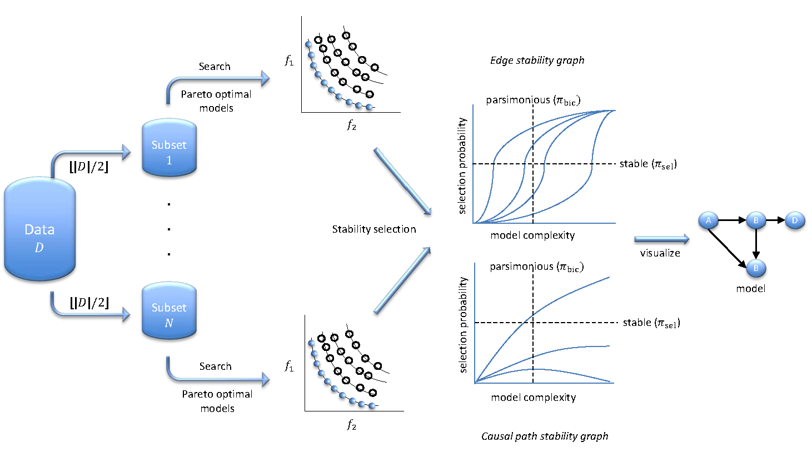

<!-- README.md is generated from README.Rmd. Please edit that file -->
stablespec
==========

Overview
--------

stablespec is an implementation of stable specification search for cross-sectional data (S3C) and for longitudinal data (S3L). S3C/L is an exploratory and heuristic approach for specification search in Structural Equation Modeling. The basic idea is to subsample the original data and then search for optimal models on each subset. Optimality is defined through two objectives: model fit and parsimony. As these objectives are conflicting, we apply a multi-objective optimization methods, specifically NSGA-II, to obtain optimal models for the whole range of model complexities. From these optimal models, we consider only the relevant model specifications (structures), i.e., those that are both stable (occur frequently) and parsimonious and use those to infer a causal model.

Illustration
------------



Installation
-----------

``` install.packages("stablespec")
   
# Or the the development version from GitHub:
# install.packages("devtools")
devtools::install_github("rahmarid/stablespec")
```

Usage
-----

``` r
library(stablespec)

the_data <- crossdata6V
numSubset <- 1
num_iteration <- 5
num_pop <- 10
mut_rate <- 0.075
cross_rate <- 0.85
longi <- FALSE
num_time <- 1
the_seed <- NULL
the_co <- "covariance"
#assummed that variable 5 does not cause variables 1, 2, and 3
cons_matrix <- matrix(c(5, 1, 5, 2, 5, 3), 3, 2, byrow=TRUE)
th <- 0.1
to_plot <- FALSE
mix <- FALSE

result <- stableSpec(theData=the_data, nSubset=numSubset,
iteration=num_iteration,
nPop=num_pop, mutRate=mut_rate, crossRate=cross_rate,
longitudinal=longi, numTime=num_time, seed=the_seed,
co=the_co, consMatrix=cons_matrix, threshold=th,
toPlot=to_plot, mixture = mix)
```

More about S3C/L
----------------

You can read about S3C and S3L from the following articles:

-   [Causality on Cross-Sectional Data: Stable Specification Search in Constrained Structural Equation Modeling](http://www.sciencedirect.com/science/article/pii/S1568494616305130)
-   [Causality on Longitudinal Data: Stable Specification Search in Constrained Structural Equation Modeling](https://arxiv.org/abs/1605.06838)
